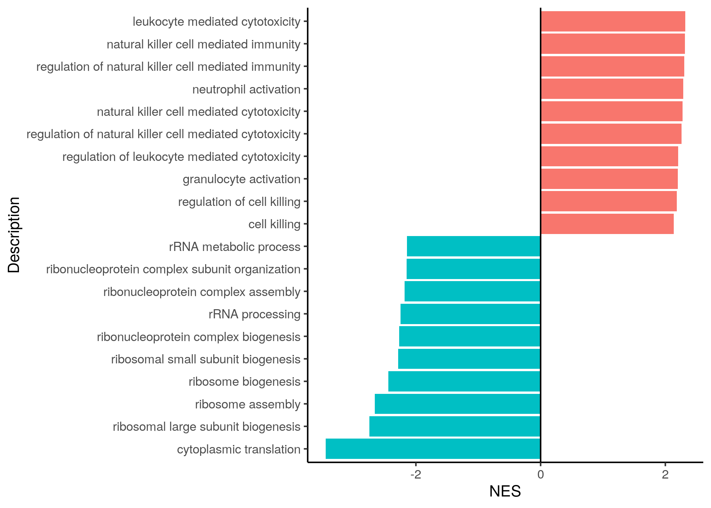

## **Bonus code**

The following code was added thanks to questions from course participants of past sessions. They might be useful for you too.


## Gene label conversions

It is often useful to convert different types of gene labels even further. Here is an example for gene label conversion 
and gene information extraction using [biomaRt](https://bioconductor.org/packages/release/bioc/html/biomaRt.html). A lot of information for each gene can be obtained, such as chromosome location,
description, biotype, or the symbols of mouse homologs of human genes, etc.

```r
# install and load the package:
BiocManager::install("biomaRt")
library(biomaRt)
# list the available options
listEnsembl()

ensembl <- useEnsembl(biomart = "genes")

# List the available species and reference genomes:
datasets <- listDatasets(ensembl)
head(datasets)
# search for human dataset and genome version:
datasets[grep("sapiens", datasets$dataset),]
# 80 hsapiens_gene_ensembl Human genes (GRCh38.p13) GRCh38.p13

# To obtain information on human genes, first the data specific to human has to be accessed from the online Ensembl repository
ensembl <- useEnsembl(biomart = "genes", dataset = "hsapiens_gene_ensembl")

# you can extract gene biotype, description, wiki gene description,
# chromosome location of genes, even strand information etc
# using the listAttributes function allows you to view the type of information per gene you can extract.
attributes <- listAttributes(ensembl)
attributes[1:15,]

# Now we extract symbol (external_gene_name), description, gene_biotype (eg whether it is a protein coding or other type of gene):
biomart_gene_info <- getBM(attributes=c("ensembl_gene_id", "external_gene_name", "description", "gene_biotype", "wikigene_description"),
                           filter="ensembl_gene_id",
                           values=NK_vs_Th$ensembl_gene_id,
                           mart=ensembl)
# check the structure of the resulting data frame:
head(biomart_gene_info)

# search for the oncogene key word in the description:
biomart_gene_info[grep("oncogene", biomart_gene_info$description),]
biomart_gene_info[grep("tumor protein", biomart_gene_info$description),]

# search for genes that have TP53 in their gene symbol:
biomart_gene_info[grep("TP53", biomart_gene_info$external_gene_name),]
```

For conversion of human gene symbols to mouse homologs for example (or vice versa if you provide mouse genes as the "values" arguments
                                                                    and "hsapiens_homolog_associated_gene_name" in the list of the attributes argument), you can also use biomaRt.

```r
# Convert human genes to mouse homologs
ensembl_human_to_mouse <- getBM(attributes=c("ensembl_gene_id","external_gene_name", "mmusculus_homolog_associated_gene_name"),
                                filter="ensembl_gene_id",
                                values=NK_vs_Th$ensembl_gene_id,
                                mart=ensembl)
head(ensembl_human_to_mouse)
# ensembl_gene_id external_gene_name mmusculus_homolog_associated_gene_name
# 1 ENSG00000000003             TSPAN6                                 Tspan6
# 2 ENSG00000000419               DPM1                                   Dpm1
# 3 ENSG00000000419               DPM1                                Gm20716
# 4 ENSG00000000457              SCYL3                                  Scyl3
# 5 ENSG00000000460           C1orf112                               BC055324
# 6 ENSG00000000938                FGR                                    Fgr
```

## msigdbr package

The [msigdbr](https://cran.r-project.org/web/packages/msigdbr/index.html) package hosted on CRAN allows to access gene set collections hosted on MSigDB directly within R. Check out its vignette to view how to download collections for other species such as mouse, zebra fish, horse, etc. The function ```msigdbr_species()``` allows you to list available species. 

For example, to download the Hallmark collection with human gene symbols within R:
```r
gmt <- msigdbr::msigdbr(species = "human", category = "H")

# Create the 2 column-format (TERM2GENE argument) required by clusterProfiler:
h_gmt <- gmt[,c("gs_name", "gene_symbol")]

```

To determine what other species are available with msigdbr:

```r
msigdbr_species()
#> # A tibble: 20 × 2
#>    species_name                    species_common_name                          
#>    <chr>                           <chr>                                        
#>  1 Anolis carolinensis             Carolina anole, green anole                  
#>  2 Bos taurus                      bovine, cattle, cow, dairy cow, domestic cat…
#>  3 Caenorhabditis elegans          NA                                           
#>  4 Canis lupus familiaris          dog, dogs                                    
#>  5 Danio rerio                     leopard danio, zebra danio, zebra fish, zebr…
#>  6 Drosophila melanogaster         fruit fly                                    
#>  7 Equus caballus                  domestic horse, equine, horse                
#>  8 Felis catus                     cat, cats, domestic cat                      
#>  9 Gallus gallus                   bantam, chicken, chickens, Gallus domesticus
#> 10 Homo sapiens                    human                                        
#> 11 Macaca mulatta                  rhesus macaque, rhesus macaques, Rhesus monk…
#> 12 Monodelphis domestica           gray short-tailed opossum                    
#> 13 Mus musculus                    house mouse, mouse                           
#> 14 Ornithorhynchus anatinus        duck-billed platypus, duckbill platypus, pla…
#> 15 Pan troglodytes                 chimpanzee                                   
#> 16 Rattus norvegicus               brown rat, Norway rat, rat, rats             
#> 17 Saccharomyces cerevisiae        baker's yeast, brewer's yeast, S. cerevisiae
#> 18 Schizosaccharomyces pombe 972h- NA                                           
#> 19 Sus scrofa                      pig, pigs, swine, wild boar                  
#> 20 Xenopus tropicalis              tropical clawed frog, western clawed frog

```

For example, we can download the Gene Ontology Biological Process (GO:BP) collection with yeast gene symbols. To first check the available collections with msigdbr, use ``msigdbr_collections()```. 

```r
print(msigdbr_collections(), n=20)
# A tibble: 23 × 3
#    gs_cat gs_subcat         num_genesets
#    <chr>  <chr>                    <int>
#  1 C1     ""                         299
#  2 C2     "CGP"                     3384
#  3 C2     "CP"                        29
#  4 C2     "CP:BIOCARTA"              292
#  5 C2     "CP:KEGG"                  186
#  6 C2     "CP:PID"                   196
#  7 C2     "CP:REACTOME"             1615
#  8 C2     "CP:WIKIPATHWAYS"          664
#  9 C3     "MIR:MIRDB"               2377
# 10 C3     "MIR:MIR_Legacy"           221
# 11 C3     "TFT:GTRD"                 518
# 12 C3     "TFT:TFT_Legacy"           610
# 13 C4     "CGN"                      427
# 14 C4     "CM"                       431
# 15 C5     "GO:BP"                   7658
# 16 C5     "GO:CC"                   1006
# 17 C5     "GO:MF"                   1738
# 18 C5     "HPO"                     5071
# 19 C6     ""                         189
# 20 C7     "IMMUNESIGDB"             4872

# Obtain the C5 category and GO:BP subcategory for yeast:

gmt <- msigdbr::msigdbr(species = "Saccharomyces cerevisiae", category = "C5", subcategory = "GO:BP")

# We obtained the GO:BP gene sets, the yeast gene symbols, and yeast ensembl_id:
head(gmt[,c("gs_name", "gene_symbol", "ensembl_gene")], n=10)
# A tibble: 10 × 3
# gs_name                                          gene_symbol ensembl_gene
# <chr>                                            <chr>       <chr>       
#   1 GOBP_10_FORMYLTETRAHYDROFOLATE_METABOLIC_PROCESS ADE3        YGR204W     
# 2 GOBP_10_FORMYLTETRAHYDROFOLATE_METABOLIC_PROCESS ADE3        YGR204W     
# 3 GOBP_10_FORMYLTETRAHYDROFOLATE_METABOLIC_PROCESS MIS1        YBR084W     
# 4 GOBP_2FE_2S_CLUSTER_ASSEMBLY                     BOL2        YGL220W     
# 5 GOBP_2FE_2S_CLUSTER_ASSEMBLY                     GRX4        YER174C     
# 6 GOBP_2FE_2S_CLUSTER_ASSEMBLY                     GRX5        YPL059W     
# 7 GOBP_2FE_2S_CLUSTER_ASSEMBLY                     JAC1        YGL018C     
# 8 GOBP_2FE_2S_CLUSTER_ASSEMBLY                     NFS1        YCL017C     
# 9 GOBP_2_OXOGLUTARATE_METABOLIC_PROCESS            ARO8        YGL202W     
# 10 GOBP_2_OXOGLUTARATE_METABOLIC_PROCESS            ADH4        YGL256W    

# If your DE genes are also labeled with gene symbol, create the 2 column-format (TERM2GENE argument) required by clusterProfiler for the GSEA() function for example:
y_gmt <- gmt[,c("gs_name", "gene_symbol")]

```

We can also use the msigdbr package to download the KEGG collection, in case the ```gseKEGG()``` function of the clusterProfiler package is blocked by firewall issues.

```r
### ---- KEGG with msigdbr download:
msigdbr_collections() # 
# C2     "CP:KEGG"      
kegg_pw<-msigdbr(species = "human", category = "C2", subcategory = "CP:KEGG")

head(kegg_pw[,c("gs_name", "gene_symbol")])
# # A tibble: 6 × 2
# gs_name               gene_symbol
# <chr>                 <chr>      
#   1 KEGG_ABC_TRANSPORTERS ABCA1      
# 2 KEGG_ABC_TRANSPORTERS ABCA10     
# 3 KEGG_ABC_TRANSPORTERS ABCA12     
# 4 KEGG_ABC_TRANSPORTERS ABCA13     
# 5 KEGG_ABC_TRANSPORTERS ABCA2      
# 6 KEGG_ABC_TRANSPORTERS ABCA3      

# Run with GSEA function: 
kegg_gsea<-GSEA(gl, eps = 0, TERM2GENE = kegg_pw[,c("gs_name", "gene_symbol")], seed = TRUE)
head(kegg_gsea@result[,c(2:6)])
#                                                                                   Description setSize enrichmentScore       NES       pvalue
# KEGG_RIBOSOME                                                                   KEGG_RIBOSOME      86      -0.9016245 -3.534228 9.828038e-49
# KEGG_NATURAL_KILLER_CELL_MEDIATED_CYTOTOXICITY KEGG_NATURAL_KILLER_CELL_MEDIATED_CYTOTOXICITY     104       0.6183274  2.509621 7.254908e-13
# KEGG_REGULATION_OF_ACTIN_CYTOSKELETON                   KEGG_REGULATION_OF_ACTIN_CYTOSKELETON     170       0.4547466  1.980859 2.337476e-07
# KEGG_CHEMOKINE_SIGNALING_PATHWAY                             KEGG_CHEMOKINE_SIGNALING_PATHWAY     161       0.4463380  1.928426 4.354445e-07
# KEGG_FC_GAMMA_R_MEDIATED_PHAGOCYTOSIS                   KEGG_FC_GAMMA_R_MEDIATED_PHAGOCYTOSIS      87       0.5343886  2.100787 1.599037e-06
# KEGG_B_CELL_RECEPTOR_SIGNALING_PATHWAY                 KEGG_B_CELL_RECEPTOR_SIGNALING_PATHWAY      70       0.5299578  1.993277 8.000155e-06

kegg_gsea@result[grep("NATURAL_KILLER", kegg_gsea@result$Description), c(2:6)]
#                                     Description setSize enrichmentScore      NES       pvalue
#  KEGG_NATURAL_KILLER_CELL_MEDIATED_CYTOTOXICITY     104       0.6183274 2.509621 7.254908e-13
```


## Code for barplots with ggplot2

Barplot of the 10 most significant gene sets:

```r
library(tidyverse)

GO_NK_Th@result %>%
  dplyr::arrange(p.adjust) %>%
  slice_head(n = 10) %>%
  ggplot(aes(x = -log10(p.adjust), y = reorder(Description, -p.adjust))) +
    geom_bar(stat = "identity") +
    geom_vline(xintercept = -log10(0.05), linetype = "dashed") +
    labs(y = "Description") +
    theme_classic()

```
  <figure>
  
  </figure>


Barplot of NES colored according to direction:
```r
sorted_GO_NK_Th %>%
  dplyr::group_by(color) %>%
  dplyr::arrange(desc(abs(NES))) %>%
  slice_head(n = 10) %>%
  ggplot(aes(x = NES, y = reorder(Description, NES), fill = color)) +
  geom_bar(stat = "identity") +
  geom_vline(xintercept = 0) +
  labs(y = "Description") +
  theme_classic() +
  theme(legend.position = "none")
```
  <figure>
  
  </figure>


## Code for a lollipop plot with ggplot2

In this lollipop of GSEA results of leukocyte-related GO pathways, the color will represent up- (red) or down-regulated (blue) gene sets, the dot size represents the setSize. The length of the gene set description is truncated to 50 characters. We use the GSEA results that we obtained after selecting the leukocyte-related GO pathways at the end of exercise 3.

```r
# Bonus: lollipop plot of p-values of leukocyte-related GO pathways. The 
# color will represent up- (red) or down-regulated (blue) gene sets, 
# the dot size represents the setSize.
# The length of the gene set description is truncated to 50 characters:

# We use the GSEA results that we obtained after selecting the leukocyte-related GO pathways at the end of exercise 3
df <- GO_NK_Th_selection@result
head(df[,1:8])
#                    ID                       Description setSize enrichmentScore       NES       pvalue   p.adjust     qvalue
# GO:0097529 GO:0097529       myeloid leukocyte migration     182       0.3358543  1.459329 0.0060333962 0.04957978 0.03849908
# GO:0030595 GO:0030595              leukocyte chemotaxis     186       0.3314487  1.446607 0.0057064461 0.04766950 0.03701573
# GO:0007159 GO:0007159      leukocyte cell-cell adhesion     335       0.2955485  1.381506 0.0037782543 0.03815146 0.02962490
# GO:0001776 GO:0001776             leukocyte homeostasis      99      -0.3891370 -1.552210 0.0037570540 0.03812616 0.02960525
# GO:0002685 GO:0002685 regulation of leukocyte migration     185       0.3418586  1.489716 0.0020160142 0.02593948 0.02014220
# GO:0070661 GO:0070661           leukocyte proliferation     273       0.3247110  1.493837 0.0009132421 0.01545176 0.01199841

df$mycolor <- ifelse(df$NES<0, "cornflowerblue","indianred2")

df <- df[order(df$pvalue, decreasing = T),] #revert the order of the rows
df$Label <-stringr::str_trunc(df$Description, 50, "right") # keep max 50 character in a string (nchar("string") to count characters)
df$Label <- factor(df$Label, levels = c(df$Label))

# Use limits of the x-axis range according to the range of p.values:
max_x <- round(max(-log10(df$p.adjust)), digits = 0) + 0.5
xlimits <- c(0, max_x)
xbreaks <- seq_along(0:max_x)

# Create the plot:
p <- ggplot(df, aes(x = Label, y = -log10(p.adjust), fill = mycolor)) +
  geom_segment(aes(x = Label, xend = Label, y = 0, yend = -log10(p.adjust)),
               color = df$mycolor, lwd = 1) +
  geom_point(pch = 21,  bg = df$mycolor, aes(size=df$setSize), color=df$mycolor) + 
  scale_size(name = "Number\nof genes") + 
  scale_y_continuous(name=expression("-"*"log"[10]*"(p-value)"), 
                     limits=xlimits,
                     breaks=xbreaks) +
  scale_x_discrete(name="") +
  theme_bw(base_size=10, base_family = "Helvetica") +
  theme(axis.text=element_text(size=12, colour = "black"),
        axis.title=element_text(size=14)) +
  ggtitle("Leukocyte-related GO pathways") +
  coord_flip()

p
```

You will obtain the following lollipop plot :
  
  <figure>
  
  </figure>


## Code for a heatmap of p-values with ggplot2

For heatmaps, ggplot2 can also be used. Here is an example for a heatmap of the p-values of 6 different gene sets (gs), and the
p-value for each gene set was calculated in two comparisons, so we compared the enrichment in genes differentially expressed
between NK cells and Th cells, and between NK cells and CD8 T cells (note that this is a dummy example just to show you the 
                                                                     example of the code, it is not based on real RNA seq data).
Before using ggplot2, you need to create a dataframe that contains a column with the gene set identities, a column with the 
name of the cell type comparisons, and a column with the p-value of each gene set in each comparison. So a specific format is 
required for ggplot2.

```r
# Create a data frame that contains the p-value for every gene set for every 
# cell type comparison. You need to include the values also for the non-significant
# gene sets. If you use function of the clusterProfiler package, you will usually
# obtain results in the @result slot only for significant gene sets. But if you need
# p-values also for the non-significant gene sets, you can change the argument
# pvalueCutoff = 1 in the gseGO function (and other functions of the clusterProfiler
# package)

# For the example, create a dummy data frame with the list of gene sets (gs), the
# 2 cell type comparisons, and the p-value for each gene set in each comparison:
ora_to_plot<-as.data.frame(cbind(ID=c("gs1", "gs2","gs3","gs4", "gs5", "gs6",
                                      "gs1", "gs2","gs3","gs4", "gs5", "gs6"),
                                 comparison=c(rep("NK_vs_Th",6), rep("NK_vs_CD8",6)),
                                 p_val=as.numeric(c(0.8,0.9,0.6, 0.054, 0.00001, 0.0003,
                                                    0.0002, 0.004, 0.001,0.01, 0.85,0.9))))

# transform the p-val to -log10(p-val):
ora_to_plot$log10_p_val<--log10(as.numeric(ora_to_plot$p_val))
# set the none-significant p-values to 0 so that they appear grey in the heatmap:
ora_to_plot$log10_p_val<-ifelse(ora_to_plot$log10_p_val<(-log10(0.05)), 0, ora_to_plot$log10_p_val)
range(ora_to_plot$log10_p_val) # [1]  0 5

head(ora_to_plot, n=12)
#     ID comparison p_val log10_p_val
# 1  gs1   NK_vs_Th   0.8    0.000000
# 2  gs2   NK_vs_Th   0.9    0.000000
# 3  gs3   NK_vs_Th   0.6    0.000000
# 4  gs4   NK_vs_Th 0.054    0.000000
# 5  gs5   NK_vs_Th 1e-05    5.000000
# 6  gs6   NK_vs_Th 3e-04    3.522879
# 7  gs1  NK_vs_CD8 2e-04    3.698970
# 8  gs2  NK_vs_CD8 0.004    2.397940
# 9  gs3  NK_vs_CD8 0.001    3.000000
# 10 gs4  NK_vs_CD8  0.01    2.000000
# 11 gs5  NK_vs_CD8  0.85    0.000000
# 12 gs6  NK_vs_CD8   0.9    0.000000

# create a palette of colors based on the Plasma palette (grDevices package)
plot(1:20, 1:20, col=hcl.colors(20,"Plasma"), pch=15, cex=3)
hcl.colors(9,"Plasma")# "RdYlGn")
breaks<-seq(from=0, to=5, by=0.5 )

color<-c("grey78", rev(hcl.colors(9,"Plasma")))

# create plot and export as png:
p<-ggplot(ora_to_plot, aes(comparison, ID, fill= log10_p_val)) + 
  geom_tile(color = "black") +
  scale_fill_gradientn(breaks= breaks, 
                       colors = color) +
  theme_bw() 
ggsave(plot = p, filename = "heatmap_p_value_ORA.png", 
       device="png",
       width = 4,height = 6)
```

You will obtain the following heatmap:
  
  <figure>
  
  </figure>


## Small information on a typical RNAseq workflow

[Download pdf](assets/pdf/brief_RNAseq_workflow.pdf){: .md-button }


## Example for DE analysis with DESeq2

[Download data](assets/exercises/htseq_counts_NK_Th.csv){: .md-button }
[Download script](assets/exercises/DGE_DESeq2_example.R){: .md-button }

```r
# DGE example with DESeq2:
# R version 4.1.2 (2021-11-01)


BiocManager::install("DESeq2")
library(DESeq2) # v 1.34.0

# setwd("path/to/downloadedData")

counts_NK_Th<-read.csv("htseq_counts_NK_Th.csv", row.names = 1, header = T)

counts_NK_Th<-counts_NK_Th[-c(which(rowSums(counts_NK_Th)==0)),]
dim(counts_NK_Th)
# [1] 38573    15

# build a sample metadata table:
coldata<-as.data.frame(cbind(cell_type=c(rep("NK", 6),
                           rep("Th", 9)),
               donor=sapply(strsplit(colnames(counts_NK_Th), "_"), '[',1),
               sample_id=colnames(counts_NK_Th)))
coldata$cell_type<-as.factor(coldata$cell_type)
coldata$cell_type<-factor(coldata$cell_type,
                          levels=levels(coldata$cell_type)[c(2,1)])

head(coldata)
#   cell_type donor         sample_id
# 1        NK   S15    S15_NK_CD56dim
# 2        NK   S15 S15_NK_CD56bright
# 3        NK   S16    S16_NK_CD56dim
# 4        NK   S16 S16_NK_CD56bright
# 5        NK   S17    S17_NK_CD56dim
# 6        NK   S17 S17_NK_CD56bright

# Create DESeq object:
dds <- DESeqDataSetFromMatrix(countData = counts_NK_Th,
                              colData = coldata,
                              design= ~ donor + cell_type) # Difference between cell types, accounting for the sample pairing
dds <- DESeq(dds)
resultsNames(dds) # lists the coefficients
# [1] "Intercept"          "donor_S16_vs_S15"   "donor_S17_vs_S15"   "cell_type_NK_vs_Th"

deseq2_NK_vs_Th <- as.data.frame(results(dds,  
                                         alpha=0.05, 
                                         contrast=c("cell_type","NK","Th"),
                                 cooksCutoff=F)) # use cooksCutoff=F only if some genes of interest do not have a calculated p-value
                                                # author recomendation is to use default cooksCutoff=T    

head(deseq2_NK_vs_Th)
#            baseMean log2FoldChange     lfcSE        stat       pvalue         padj
# TSPAN6     40.851111     -6.9583034 1.1044621 -6.30017417 2.973114e-10 8.742152e-09
# TNMD        0.104281     -0.1228379 3.1336380 -0.03919977 9.687311e-01           NA
# DPM1     2566.964652     -0.1466129 0.2211112 -0.66307338 5.072836e-01 7.133950e-01
# SCYL3     571.791633      0.5728065 0.4039864  1.41788547 1.562242e-01 3.515869e-01
# C1orf112  201.504414      0.8758449 0.5938469  1.47486651 1.402484e-01 3.263445e-01
# FGR      8793.900467      8.5188295 1.2025099  7.08420757 1.398422e-12 5.868549e-11

deseq2_NK_vs_Th[grep("CPS1", rownames(deseq2_NK_vs_Th)),]
#            baseMean log2FoldChange    lfcSE        stat     pvalue      padj
# CPS1     2.34916186    -3.56324252 1.855768 -1.92009033 0.05484649 0.1702518
# CPS1.IT1 0.09375824    -0.08381473 3.134376 -0.02674048 0.97866673        NA
deseq2_NK_vs_Th[grep("GZMB", rownames(deseq2_NK_vs_Th)),]
#      baseMean log2FoldChange     lfcSE     stat       pvalue        padj
# GZMB 27758.47       9.075387 0.8897603 10.19981 1.986563e-24 2.65665e-22

```


