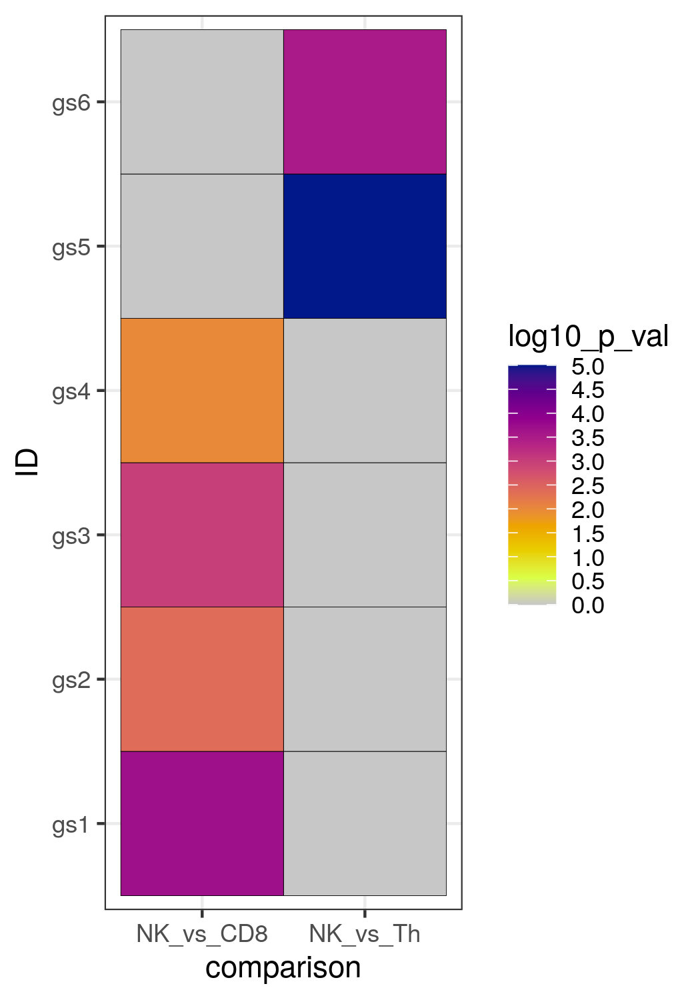

In this section, you will find the R code that we will use during the course. We will explain the code and output during correction of the exercises.

## Source of data

We will work with RNA sequencing data generated by [Ercolano et al 2020](https://jlb.onlinelibrary.wiley.com/doi/10.1002/JLB.5MA0120-209R).
This study was a descriptive study of immune cells that are circulating in the blood of humans in healthy conditions. Different types of immune cells
circulate in human blood. The goal of this study was to determine differences in transcriptomes between 2 cell types, Natural Killer (NK) cells and
CD4+ T helper (Th) cells. These 2 types of cells have different functions: NK cells provide a rapid response in the innate immune response at the beginning of an infection such as
by a virus, and are able to kill virus-infected cells by secreting cytotoxic molecules; Th cells have an important role in the adaptive immune response by aiding antigen-presenting cells by secreting different panels of cytokines depending on the type of pathogen infecting the host. 

The RNA sequencing data that we provide includes the results of a differential gene expression analysis comparing NK cells to Th cells. The differential
gene expression analysis was performed using limma (see Links page). 

Before starting the exercises, set the working environment to where you have downloaded the files for the exercises 
and load the necessary packages. Also, set the seed so that results are replicable.

!!! warning
    When using setwd(), change the path within quotes to where you have saved the data for the exercises


```r
setwd("/path/to/data/")

library(clusterProfiler)
library(enrichplot)
library(pathview)
library(org.Hs.eg.db)

# set seed
set.seed(1234)

```

## Exercise 1


Import the data into your R session and explore its structure: what are the different columns corresponding to?
How can you search for a particular gene within this table?

```r
# Import DE table:
NK_vs_Th<-read.csv("NK_vs_Th_diff_gene_exercise_1.csv",
                   header = T)
                   
# Look at table structure:
head(NK_vs_Th)

# Search for CPS1 in symbol column:
NK_vs_Th[which(NK_vs_Th$symbol=="CPS1"),]
``` 

There is a function that is part of the stats package called p.adjust(), that allows you to perform p-value
adjustment. Look at the help of the function and try to understand the arguments that can be used. 
```r
?p.adjust
```


Then create a new column in your "NK_vs_Th" data frame that contains the output of p-value adjustment calculated
using the p.adjust() function, and a Benjamini-Hochberg procedure. Finally, count the number of genes that are significantly up-regulated and down-regulated after
p-value adjustment. 


??? done "Answer"
	```r
	NK_vs_Th$p.adj <- p.adjust(NK_vs_Th$P.Value, method = "BH")
	
	# Summary of DE genes:
	# Number of down-regulated genes:
	summary(NK_vs_Th$p.adj<=0.05&NK_vs_Th$logFC<0)
	#    Mode   FALSE    TRUE 
	# logical   18590    1895 
	# Number of up-regulated genes:
	summary(NK_vs_Th$p.adj<=0.05&NK_vs_Th$logFC>0)
	# Mode      FALSE    TRUE 
	# logical   18528    1957 
	```

We can now compare the raw p-value and adjusted p-value for any gene. Raw p-values that are close to 0.05 will often become higher than 0.05 after adjustment,
while very small p-values more likely remain below 0.05 after adjustment. 

```r
NK_vs_Th[which(NK_vs_Th$symbol=="CPS1"),]

NK_vs_Th[which(NK_vs_Th$symbol=="GZMB"),]

```


## Exercise 2

If we expect a particular group (or set) of genes to be altered between 2 conditions, we can specifically test for this using a single Fisher test, i.e an over-representation analysis.
Here, because we compared cells that are involved in the innate immune response (NK cells) to cells involved in the adaptive immune response (Th cells), we
expect that there are differences in genes involved in the adaptive immune response. Which direction do you think the adaptive immune response genes should have? Rather up-regulated in NK or down-regulated in NK vs Th cells?

As you will see later in the course, there are databases available where you can obtain gene sets. We have obtained the adaptive immune response gene set from Gene Ontology.
Import the list of genes included in this gene set, and build a contingency table of number of genes that are part of the gene set or not and number of genes 
that are significantly up-regulated or not.

```r
adimresp_term2gene<-read.csv("adaptive_immune_response_geneset_term2gene.csv",
                             header = T)
nrow(adimresp_term2gene) # 663
View(adimresp_term2gene)
```

RNA sequencing analysis often involves filtering genes to remove lowly expressed genes. Therefore, it is possible that not all genes that are part of a gene set are 
found in your RNA seq dataset. Check how many genes in the gene sets are part of the RNA seq data set.

```r
length(which(NK_vs_Th$symbol %in% adimresp_term2gene$V2)) # 485
```

Determine the number of up-regulated genes that are within or outside of the gene set of interest.
```r
NK_up<-subset(NK_vs_Th, 
              NK_vs_Th$p.adj<=0.05&NK_vs_Th$logFC>0)

summary(NK_up$symbol %in% adimresp_term2gene$V2)
#    Mode   FALSE    TRUE 
# logical    1882      75

NK_not_DE<-subset(NK_vs_Th, NK_vs_Th$p.adj>0.05)
summary(NK_not_DE$symbol %in% adimresp_term2gene$V2)
#    Mode   FALSE    TRUE 
# logical   16363     270
```

Build the contingency table of number of genes that are up-regulated or not and part of the gene set or not, then run the Fisher test. What is the result?

```r
cont.table<-matrix(c(75, 1882, 270, 16363), ncol=2,byrow = F)

colnames(cont.table)<-c("up", "not_up")
rownames(cont.table)<-c("in_set", "not_in_set")
cont.table
#              up not_up
# in_set       75    270
# not_in_set 1882  16363


fisher.test(cont.table)
```

**Bonus** How would you represent this result? An option might be a volcano plot coloring genes that are part of the gene set 
and significant using [ggplot2](https://ggplot2.tidyverse.org/).

```r
library(ggplot2)
library(ggrepel)

sig_genes<-subset(NK_vs_Th, NK_vs_Th$symbol %in% adimresp_term2gene$V2 & NK_vs_Th$p.adj<=0.05)
sig_genes_label<-subset(sig_genes, sig_genes$p.adj<=0.00001)

ggplot(NK_vs_Th, aes(x = logFC,  # invert to focus AG221 vs DMSO
                     y = -log10(p.adj))) +
        geom_point(color="grey87")  +
        ggtitle("Genes belonging to the adaptive immune response gene set") +
        theme_bw() +
        geom_text_repel(data = sig_genes_label, 
                        aes(x=logFC,
                            y=-log10(p.adj),label=symbol),
                        max.overlaps = 20) +
        geom_point(data=sig_genes, col="dodgerblue2") +
        theme(legend.position = "none") +
        scale_x_continuous(name = "log2(fold change) NK vs Th cells") +
        scale_y_continuous(name = "-log10 p-value") +
        geom_hline(yintercept = -log10(0.05), linetype="dashed") +
        geom_vline(xintercept = 0, linetype="dashed")
```


Next, we will use functions of the clusterProfiler package to perform a gene set enrichment analysis (GSEA) of Gene Ontology terms. For this, we first need
to create a vector with the t-statistic for each gene, assign the gene symbol to each t-statistic in the vector (i.e. names), then sort the vector.

!!! warning
		A single gene can be labeled with different types of gene labels: Ensembl IDs, NCBI Entrez IDs, gene symbols, UniProt IDs, etc. 
		Therefore, first check whether the way the genes are labeled is supported by clusterProfiler using:
		```r
		idType(OrgDb = "org.Hs.eg.db") # to determine allowed gene id type
		```
Create the named and sorted vector of t-statistics (i.e. for the geneList argument of the gseGO() function). 

```r
gl<-NK_vs_Th$t
names(gl)<-make.names(NK_vs_Th$symbol, unique = T)
gl<-gl[order(gl, decreasing = T)]

GO_NK_Th<-gseGO(gl, ont="BP",
                OrgDb = org.Hs.eg.db,
                keyType = "SYMBOL",
                minGSSize=30,
                eps=1e-50,
                seed=T)
```

Explore the new object that was created. What is its structure? What does it contain? Is the adaptive immune response gene set significant?

??? done "Answer"
	```r
		class(GO_NK_Th)
		str(GO_NK_Th)
		View(GO_NK_Th@result)
	
		GO_NK_Th@result[GO_NK_Th@result$Description=="adaptive immune response",]
	```
	
Count the number of up- and down-regulated gene sets similarly to how we counted the number of significant genes in exercise 1:

```
summary(GO_NK_Th@result$p.adjust<0.05&GO_NK_Th@result$NES<0)
Mode   FALSE    TRUE 
# logical    303      86 
summary(GO_NK_Th@result$p.adjust<0.05&GO_NK_Th@result$NES>0)
#     Mode   FALSE    TRUE 
# logical      86     303 
```


Finally, you can export the results to a csv file, if you would want to summarize the results using Revigo for example (see later in course).
To obtain the list of leading edge genes, split the corresponding column in the @result slot on the based on the slash. And if you want to obtain a full list
of genes belonging to a particular GO term, this information is also stored in the @geneSets slot.
```r
# Export results
write.csv(GO_NK_Th@result, "GO_GSEA_NK_vs_Th.csv",
          row.names = F, quote = F)

# How to obtain the list of leading edge genes for a gene set:
unlist(strsplit(GO_NK_Th@result[GO_NK_Th@result$Description=="adaptive immune response",11],
                "\\/"))

# How to obtain the list of all genes included in a GO term:
GO_NK_Th@geneSets$`GO:0002250`
```

**Bonus** In the context of single-cell RNA sequencing data, single-cells are clustered, and marker genes per cluster are obtained. In this case, we
don't always obtain a t-statistic or fold change value for every gene in the dataset, but rather a simple list of significant genes. With this list,
you can perform an over-representation analysis of the GO terms using enrichGO(). The output will not contain enrichment scores, but rather p-values for
every gene set.

```r
GO_enrich<-enrichGO(gene=NK_up$symbol,
                    OrgDb = org.Hs.eg.db,
                    keyType = "SYMBOL",
                    minGSSize=30,
                    universe = NK_vs_Th$symbol)
View(GO_enrich@result)
```

## Exercise 3

For GSEA of the KEGG gene sets, the gene IDs have to be NCBI Entrez gene IDs. ClusterProfiler provides the bitr() function to convert gene label types.

```r
keytypes(org.Hs.eg.db)
# convert from= "ENSEMBL" to "SYMBOL" and "ENTREZID"
gene_convert <- bitr(as.character(NK_vs_Th$ensembl_gene_id), 
                     fromType="ENSEMBL", 
                     toType=c("SYMBOL", "ENTREZID"), OrgDb="org.Hs.eg.db")

# Check the format of the data frame obtained after conversion:                     
head(gene_convert)
dim(gene_convert)
```

Similarly to the gseGO() function, we need to provide a named and sorted vector of t-statistics, the difference is that the names will be Entrez gene IDs.

```r
# Create a vector of genes that are coded with the EntrezID:
# use the sorted gene list gl previously created:
gl_kegg<-cbind(SYMBOL=names(gl), t=gl)

# merge with converted gene symbols to combine both:
# by default the data frames are merged on the columns with names they both have
gl_kegg<-merge(gl_kegg, gene_convert)
head(gl_kegg)

gl_kegg_list<-as.numeric(as.character(gl_kegg$t))
names(gl_kegg_list)<-as.character(gl_kegg$ENTREZID)
gl_kegg_list<-sort(gl_kegg_list, decreasing = T)

# run GSEA of KEGG:
KEGG_NK_Th<-gseKEGG(gl_kegg_list, organism = "hsa", "ncbi-geneid",
                    minGSSize = 30,
                    eps=1e-50,
                    seed=T)
```
Explore the new object that was created. What is its structure? What does it contain? How many gene sets are up-regulated? Is their an immune-related gene set significant?
Because we had NK cells in our dataset, is the [NK cell-mediated cytotoxicity](https://www.genome.jp/pathway/hsa04650) KEGG gene set significant? What is the total number of built-in
KEGG gene sets and how can you view the genes included in a particular gene set?

??? done "Answer"
	```r
		str(KEGG_KEGG_NK_Th)
		View(KEGG_NK_Th@result)

		# Up-regulated gene sets:
		summary(KEGG_NK_Th@result$NES>0)

		KEGG_NK_Th@result[grep("immune",KEGG_NK_Th@result$Description), ]

		KEGG_NK_Th@result[grep("Natural killer",KEGG_NK_Th@result$Description), ]

		# How many built-in KEGG pathways are there?
		length(KEGG_NK_Th@geneSets)

		KEGG_NK_Th@geneSets$hsa04650 # coded as Entrez Gene ID...
	```

Very often, researchers have their own gene sets in mind, either that they compiled from the literature, or that they defined from
previous experiments. If this is the case for your experiment, you can generate an Excel file that contains one gene set per row, the 2 first columns
contain the gene set ID and the gene set description, and the genes that belong to each gene set are listed in the next columns. To have an idea of
the structure of this file, open the .gmt file that we provided using Excel or a Text editor.

In this exercise, we will perform a GSEA of the 50 hallmark gene sets can be downloaded from [MSigDB](http://www.gsea-msigdb.org/gsea/downloads.jsp).
Import the Hallmark gene sets using read.gmt(). What is the format of the object that is created? Use the GSEA function, by providing the named and sorted
vector of t-statistics we used above with gseGO(). Why do we use this one and not the one created for gseKEGG()?

```r
# Import hallmark, convert to term2gene and run GSEA:
term2gene_h<-read.gmt("h.all.v7.1.symbols.gmt")
head(term2gene_h)
length(unique(term2gene_h$term))

# Run GSEA with the function that allows to use custom gene sets, 
# provide the named vector of t statistics
h_NK_vs_Th<-GSEA(gl, TERM2GENE = term2gene_h,
                eps=1e-50,
                seed=T)

View(h_NK_vs_Th@result)

# Number of significant gene sets:
length(which(h_NK_vs_Th@result$p.adjust<=0.05)) 
```

In the last section of the course, we will see several visualization methods of GSEA or over-representation analysis results. As a teaser, create a dotplot of 
significant hallmark gene sets:

```r
dotplot(h_NK_vs_Th, orderBy="p.adjust")
```


## Exercise 4, the last one :sun_with_face: :scientist_tone3:


Once we have performed a GSEA or over-representation analysis, we need of course to show the results and prepare figures for a publication. Several visualizations are possible.
The first option is a barplot. It can be a barplot of p-values of top over-represented GO terms. P-values are usually transformed with -log10, so that the 
very small p-values are emphasized compared to p-values that are closer to 0.05. 

A barplot can also be created with the NES obtained after GSEA, to show which gene sets are up-regulated and which are down-regulated.
The barplot() function is part of the graphics package and can be used for over-representation results.

```r
par(mar=c(5,20,3,3))
barplot(rev(-log10(GO_NK_Th@result$pvalue[1:10])),
        horiz = T, names=rev(GO_NK_Th@result$Description[1:10]),
        las=2, xlab="-log10(adj.p-value)",
        cex.names = 0.7,
        col="lightgreen") 
abline(v=-log10(0.05))
```

Now that you know how to use the barplot() function, how would you create a barplot of NES of the top 10 up-regulated and the top 10 down-regulated genes sets,
 with red bars for the up-regulated gene sets and blue bars for the down-regulated gene sets?

??? done "Answer"
	```r
		# Barplot of NES of the top GO gene sets, with different color for up- or down-reg gene sets:
		sorted_GO_NK_Th<- GO_NK_Th@result[order(GO_NK_Th@result$NES, decreasing = F),]
		sorted_GO_NK_Th$color<-ifelse(sorted_GO_NK_Th$NES<0, "red", "darkblue")

		par(mar=c(5,20,3,3))
		barplot(sorted_GO_NK_Th$NES[c(1:10, (nrow(sorted_GO_NK_Th)-9):nrow(sorted_GO_NK_Th))],
        	horiz = T, names=sorted_GO_NK_Th$Description[c(1:10, (nrow(sorted_GO_NK_Th)-9):nrow(sorted_GO_NK_Th))],
        	las=2, xlab="NES",
        	cex.names = 0.7,
        	col=sorted_GO_NK_Th$color[c(1:10, (nrow(sorted_GO_NK_Th)-9):nrow(sorted_GO_NK_Th))]) 
	```

A common way to represent the enrichment score of a single gene set after GSEA is the barcode plot, with the gseaplot() function that can be used
directly on objects of class "gseaResult" (i.e. output by clusterProfiler functions). Try here with the MTORC1 signaling gene set.

```r
gseaplot(h_NK_vs_Th, geneSetID = "HALLMARK_MTORC1_SIGNALING",
         title="HALLMARK_MTORC1_SIGNALING")
```

If you have performed a GSEA of the KEGG pathways, it is possible to overlay the fold change values of your genes on top of the
KEGG pathway maps available online. For this, create a named vector of fold change values, where the non-significant genes will be grey, while the up- and down-
regulated genes will be colored in the KEGG pathway map. The pathview() function comes from the pathview package (surprisingly...)

```r
# pathview map with non-significant genes in grey:
# set log fold change of non-significant genes to 0:
NK_vs_Th$logFC_0<-ifelse(NK_vs_Th$p.adj>0.05, 0, NK_vs_Th$logFC)

# create named vector of fold change values:
genePW<-NK_vs_Th$logFC_0
names(genePW)<-NK_vs_Th$symbol

# create pathview map of Natural killer cell mediated cytotoxicity = hsa04650
pathview(gene.data  = genePW,
         pathway.id = "hsa04650",
         species    = "hsa",
         gene.idtype = "SYMBOL")

# pathview map for Ribosome = hsa03010
pathview(gene.data  = genePW,
         pathway.id = "hsa03010",
         species    = "hsa",
         gene.idtype = "SYMBOL")
```
Finally, clusterProfiler provides several visualization methods that can be used directly on objects of class "gseaResult". The barplot function
can be used on these objects, and you can either show the top significant gene sets, or a custom selection. Also, a dotplot can be used.

```r
# Generate a quick GO over-representation analysis with the top most highly over-expressed genes in NK:
NK_up_2 <-subset(NK_vs_Th, 
              NK_vs_Th$p.adj<=0.05&NK_vs_Th$logFC>3)
NK_up_2<-as.character(NK_up_2$symbol)

ego <- enrichGO(NK_up_2, OrgDb='org.Hs.eg.db', ont="BP", keyType = "SYMBOL")

barplot(ego)

ego_selection = ego[ego$ID == "GO:0002703" || ego$ID == "GO:0002228", asis=T]
barplot(ego_selection)

dotplot(ego, orderBy="p.adjust")
```

For plots that show similarity among gene sets, use the following functions:

```r
# Which genes are shared by several gene sets:
cnetplot(ego, categorySize="pvalue")

# Similarity among gene sets:
ego2 <- pairwise_termsim(ego)
emapplot(ego2)
emapplot_cluster(ego2)

# Distribution of t-statistic for genes included in significant gene sets or in selected gene sets:
ridgeplot(GO_NK_Th)

GO_NK_Th_selection <- GO_NK_Th[GO_NK_Th$ID == "GO:0000184", asis=T]
ridgeplot(GO_NK_Th_selection)
GO_NK_Th_selection <- GO_NK_Th[GO_NK_Th$ID == "GO:0006613", asis=T]
ridgeplot(GO_NK_Th_selection)
GO_NK_Th_selection <- GO_NK_Th[grep("membrane",GO_NK_Th@result$Description), asis=T]
ridgeplot(GO_NK_Th_selection)
```


## Feedback :sparkle:
Thanks for attending this course! Don't forget to give honest feedback via [this feedback form](https://edu.sib.swiss/course/view.php?id=550). 


## Extra exercise for ECTS credits
- Perform GSEA of the NK vs Th data using the Reactome gene sets downloaded from the 
MSigDB website [here](http://www.gsea-msigdb.org/gsea/msigdb/download_file.jsp?filePath=/msigdb/release/7.4/c2.cp.reactome.v7.4.symbols.gmt).
- How many gene sets are significantly enriched? Generate an ordered barplot of the NES of all genesets, and generate a barcode plot for the gene set with the lowest NES

Steps

- Import the reactome gene sets of the file c2.cp.reactome.v7.1.symbols.gmt using read.gmt()

- Use GSEA providing a sorted named vector of t-statistics and the reactome gene sets, use minGSSize=30

- Count the number of significant adjusted p-values

- Use barplot() and gseaplot() for the visualization of the results


## **More bonus** :champagne_glass:

## Gene label conversions


It is often useful to convert different types of gene labels even further. Here is an example for gene label conversion 
and gene information extraction using [biomaRt](https://bioconductor.org/packages/release/bioc/html/biomaRt.html). A lot of information for each gene can be obtained, such as chromosome location,
description, biotype, or the symbols of mouse homologs of human genes, etc.

```r
# install and load the package:
BiocManager::install("biomaRt")
library(biomaRt)
# list the available options
listEnsembl()

ensembl <- useEnsembl(biomart = "genes")

# List the available species and reference genomes:
datasets <- listDatasets(ensembl)
head(datasets)
# search for human dataset and genome version:
datasets[grep("sapiens", datasets$dataset),]
# 80 hsapiens_gene_ensembl Human genes (GRCh38.p13) GRCh38.p13

# To obtain information on human genes, first the data specific to human has to be accessed from the online Ensembl repository
ensembl <- useEnsembl(biomart = "genes", dataset = "hsapiens_gene_ensembl")

# you can extract gene biotype, description, wiki gene description,
# chromosome location of genes, even strand information etc
# using the listAttributes function allows you to view the type of information per gene you can extract.
attributes <- listAttributes(ensembl)
attributes[1:15,]

# Now we extract symbol (external_gene_name), description, gene_biotype (eg whether it is a protein coding or other type of gene):
biomart_gene_info <- getBM(attributes=c("ensembl_gene_id", "external_gene_name", "description", "gene_biotype", "wikigene_description"),
                           filter="ensembl_gene_id",
                           values=NK_vs_Th$ensembl_gene_id,
                           mart=ensembl)
# check the structure of the resulting data frame:
head(biomart_gene_info)

# search for the oncogene key word in the description:
biomart_gene_info[grep("oncogene", biomart_gene_info$description),]
biomart_gene_info[grep("tumor protein", biomart_gene_info$description),]

# search for genes that have TP53 in their gene symbol:
biomart_gene_info[grep("TP53", biomart_gene_info$external_gene_name),]
```

For conversion of human gene symbols to mouse homologs for example (or vice versa if you provide mouse genes as the "values" arguments
and "hsapiens_homolog_associated_gene_name" in the list of the attributes argument), you can also use biomaRt.

```r
# Convert human genes to mouse homologs
ensembl_human_to_mouse <- getBM(attributes=c("ensembl_gene_id","external_gene_name", "mmusculus_homolog_associated_gene_name"),
                          filter="ensembl_gene_id",
                          values=NK_vs_Th$ensembl_gene_id,
                          mart=ensembl)
head(ensembl_human_to_mouse)
# ensembl_gene_id external_gene_name mmusculus_homolog_associated_gene_name
# 1 ENSG00000000003             TSPAN6                                 Tspan6
# 2 ENSG00000000419               DPM1                                   Dpm1
# 3 ENSG00000000419               DPM1                                Gm20716
# 4 ENSG00000000457              SCYL3                                  Scyl3
# 5 ENSG00000000460           C1orf112                               BC055324
# 6 ENSG00000000938                FGR                                    Fgr
```

## Code for a heatmap of p-values

For heatmaps, ggplot2 can also be used. Here is an example for a heatmap of the p-values of 6 different gene sets (gs), and the
p-value for each gene set was calculated in two comparisons, so we compared the enrichment in genes differentially expressed
between NK cells and Th cells, and between NK cells and CD8 T cells (note that this is a dummy example just to show you the 
example of the code, it is not based on real RNA seq data).
Before using ggplot2, you need to create a dataframe that contains a column with the gene set identities, a column with the 
name of the cell type comparisons, and a column with the p-value of each gene set in each comparison. So a specific format is 
required for ggplot2.

```r
# Create a data frame that contains the p-value for every gene set for every 
# cell type comparison. You need to include the values also for the non-significant
# gene sets. If you use function of the clusterProfiler package, you will usually
# obtain results in the @result slot only for significant gene sets. But if you need
# p-values also for the non-significant gene sets, you can change the argument
# pvalueCutoff = 1 in the gseGO function (and other functions of the clusterProfiler
# package)

# For the example, create a dummy data frame with the list of gene sets (gs), the
# 2 cell type comparisons, and the p-value for each gene set in each comparison:
ora_to_plot<-as.data.frame(cbind(ID=c("gs1", "gs2","gs3","gs4", "gs5", "gs6",
                        "gs1", "gs2","gs3","gs4", "gs5", "gs6"),
                   comparison=c(rep("NK_vs_Th",6), rep("NK_vs_CD8",6)),
                   p_val=as.numeric(c(0.8,0.9,0.6, 0.054, 0.00001, 0.0003,
                           0.0002, 0.004, 0.001,0.01, 0.85,0.9))))

# transform the p-val to -log10(p-val):
ora_to_plot$log10_p_val<--log10(as.numeric(ora_to_plot$p_val))
# set the none-significant p-values to 0 so that they appear grey in the heatmap:
ora_to_plot$log10_p_val<-ifelse(ora_to_plot$log10_p_val<(-log10(0.05)), 0, ora_to_plot$log10_p_val)
range(ora_to_plot$log10_p_val) # [1]  0 5

head(ora_to_plot, n=12)
#     ID comparison p_val log10_p_val
# 1  gs1   NK_vs_Th   0.8    0.000000
# 2  gs2   NK_vs_Th   0.9    0.000000
# 3  gs3   NK_vs_Th   0.6    0.000000
# 4  gs4   NK_vs_Th 0.054    0.000000
# 5  gs5   NK_vs_Th 1e-05    5.000000
# 6  gs6   NK_vs_Th 3e-04    3.522879
# 7  gs1  NK_vs_CD8 2e-04    3.698970
# 8  gs2  NK_vs_CD8 0.004    2.397940
# 9  gs3  NK_vs_CD8 0.001    3.000000
# 10 gs4  NK_vs_CD8  0.01    2.000000
# 11 gs5  NK_vs_CD8  0.85    0.000000
# 12 gs6  NK_vs_CD8   0.9    0.000000

# create a palette of colors based on the Plasma palette (grDevices package)
plot(1:20, 1:20, col=hcl.colors(20,"Plasma"), pch=15, cex=3)
hcl.colors(9,"Plasma")# "RdYlGn")
breaks<-seq(from=0, to=5, by=0.5 )

color<-c("grey78", rev(hcl.colors(9,"Plasma")))

# create plot and export as png:
p<-ggplot(ora_to_plot, aes(comparison, ID, fill= log10_p_val)) + 
        geom_tile(color = "black") +
        scale_fill_gradientn(breaks= breaks, 
                             colors = color) +
        theme_bw() 
ggsave(plot = p, filename = "heatmap_p_value_ORA.png", 
       device="png",
               width = 4,height = 6)
```

You will obtain the following heatmap:

<figure>
  
</figure>


